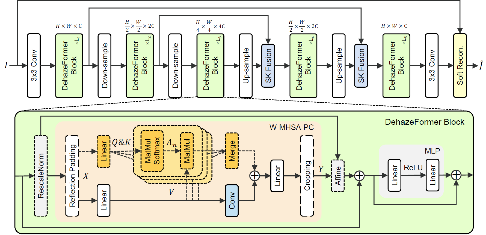

# Vision Transformers for Single Image Dehazing

[](https://arxiv.org/abs/2204.03883) [](https://drive.google.com/drive/folders/1oaQSpdYHxEv-nMOB7yCLKfw2NDCJVtrx?usp=sharing) 
[](https://drive.google.com/drive/folders/1gnQiI_7Dvy-ZdQUVYXt7pW0EFQkpK39B?usp=sharing)

> **Abstract:** 
Image dehazing is a representative low-level vision task that estimates latent haze-free images from hazy images.
In recent years, convolutional neural network-based methods have dominated image dehazing.
However, vision Transformers, which has recently made a breakthrough in high-level vision tasks, has not brought new dimensions to image dehazing.
We start with the popular Swin Transformer and find that several of its key designs are unsuitable for image dehazing.
To this end, we propose DehazeFormer, which consists of various improvements, such as the modified normalization layer, activation function, and spatial information aggregation scheme.
We train multiple variants of DehazeFormer on various datasets to demonstrate its effectiveness.
Specifically, on the most frequently used SOTS indoor set, our small model outperforms FFA-Net with only 25\% \#Param and 5\% computational cost.
To the best of our knowledge, our large model is the first method with the PSNR over 40 dB on the SOTS indoor set, dramatically outperforming the previous state-of-the-art methods.
We also collect a large-scale realistic remote sensing dehazing dataset for evaluating the method's capability to remove highly non-homogeneous haze.

### Network Architecture



### News

- **Apr 12, 2022:** Add a new variant named DehazeFormer-W with 39.19 dB (SOTS indoor) / 9.68M #Param / 94.43G MACs.
- **Apr 11, 2022:** Arxiv paper link is updated.
- **Apr 7, 2022:** Beta version is released, including codes, pre-trained models, and RS-Haze-RGB.

## Getting started

### Install

We test the code on PyTorch 1.10.2 + CUDA 11.3 + cuDNN 8.2.0.

1. Create a new conda environment
```
conda create -n pt1102 python=3.7
conda activate pt1102
```

2. Install dependencies
```
conda install pytorch=1.10.2 torchvision torchaudio cudatoolkit=11.3 -c pytorch
pip install -r requirements.txt
```

### Download

You can download the pretrained models and datasets on [GoogleDrive](https://drive.google.com/drive/folders/1Yy_GH6_bydYPU6_JJzFQwig4LTh86VI4?usp=sharing).

Currently, we only provide gamma-corrected RGB images of our RS-Haze dataset.

The final file path should be the same as the following:

```
┬─ save_models
│   ├─ indoor
│   │   ├─ dehazeformer-b.pth
│   │   └─ ... (model name)
│   └─ ... (exp name)
└─ data
    ├─ RESIDE-IN
    │   ├─ train
    │   │   ├─ GT
    │   │   │   └─ ... (image filename)
    │   │   └─ hazy
    │   │       └─ ... (corresponds to the former)
    │   └─ test
    │       └─ ...
    └─ ... (dataset name)
```

## Training and Evaluation

In order to align the folder structure of each dataset, we rearrange the original dataset.

### Train

You can modify the training settings for each experiment in the `configs` folder.
Then run the following script to train the model:

```sh
python train.py --model (model name) --dataset (dataset name) --exp (exp name)
```

For example, we train the DehazeFormer-B on the ITS:

```sh
python train.py --model dehazeformer-b --dataset RESIDE-IN --exp indoor
```

TensorBoard will record the loss and evaluation performance during training.

### Test

Run the following script to test the trained model:

```sh
python test.py --model (model name) --dataset (dataset name) --exp (exp name)
```

For example, we test the DehazeFormer-B on the SOTS indoor set:

```sh
python test.py --model dehazeformer-b --dataset RESIDE-IN --exp indoor
```

Main test scripts can be found in `run.sh`.

### Predict

Run the following script to fetch the results:

```sh
python predict.py --model (model name) --folder (folder name) --exp (exp name)
```

For example, we fetch the results of DehazeFormer-B on the SOTS indoor set:

```sh
python predict.py --model dehazeformer-b --folder RESIDE-IN/test/hazy --exp indoor
```

## Notes

1. Currently, this repository provides roughly organized code, please send me an email (syd@zju.edu.cn) if you find problems. 
2. We found that the test results using opencv installed with conda are lower than those using opencv installed with pypi (RESIDE-OUT, RESIDE-6K), since they call different JPEG image codecs.
